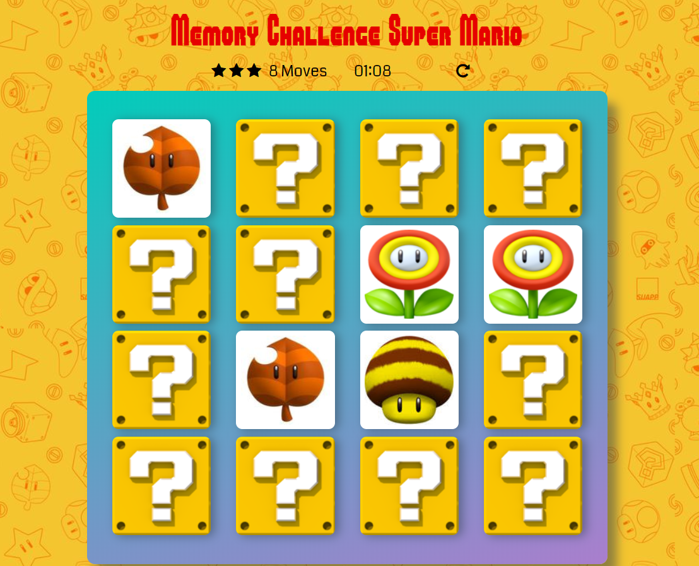

# Memory Challenge Super Mario

This is a project for Udacity Front-End Web Developer Nanodegree program: A matching game based in Super Mario.

## How to play

The player needs to pick two cards of their choosing. If the cards have the same rank (two super mushrooms, for example), the player keeps the pair. If not, the cards are returned to their face-down position. Play until all the cards have been matched.

At the end of the game it will be shown how much time you have taken and its performance, which is measured by the number of stars. Stars decrease according to the amount of movement they needed to win.

Play the game on: https://raphaellibellini.github.io/fend-project-memory-game/

## Screenshot

## Animation

animate.css -http://daneden.me/animate Version - 3.6.0

Licensed under the MIT license - http://opensource.org/licenses/MIT

Copyright (c) 2018 Daniel Eden
